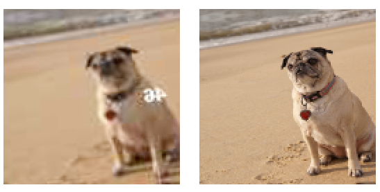
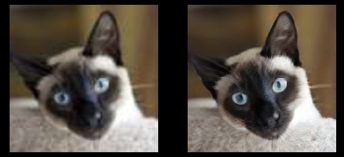
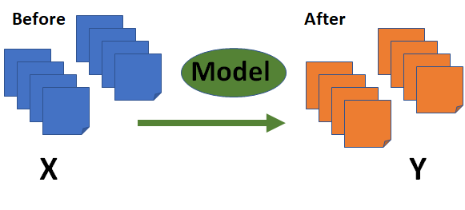
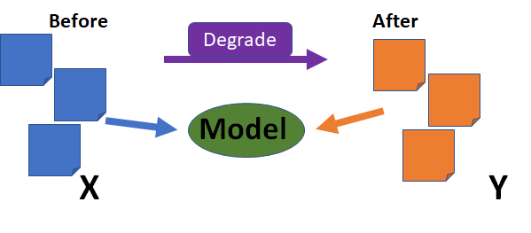
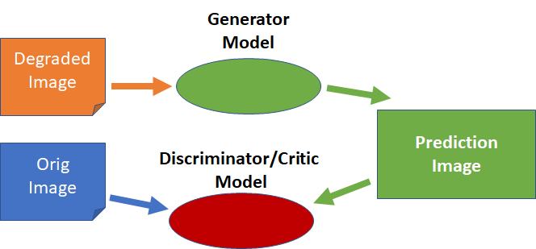
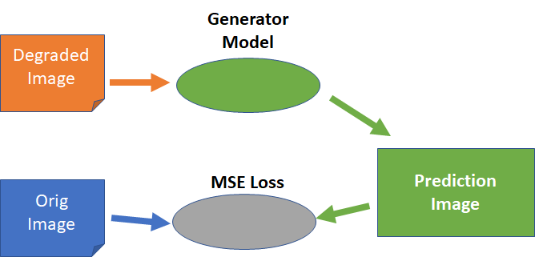
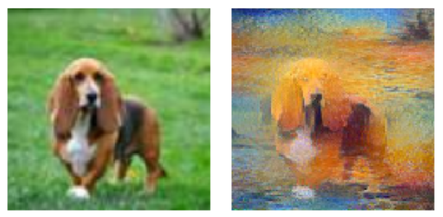
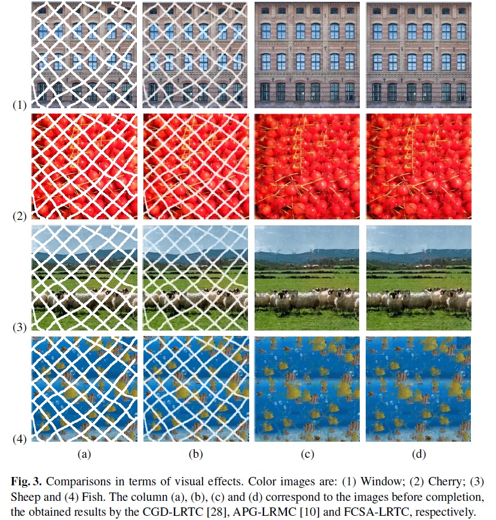
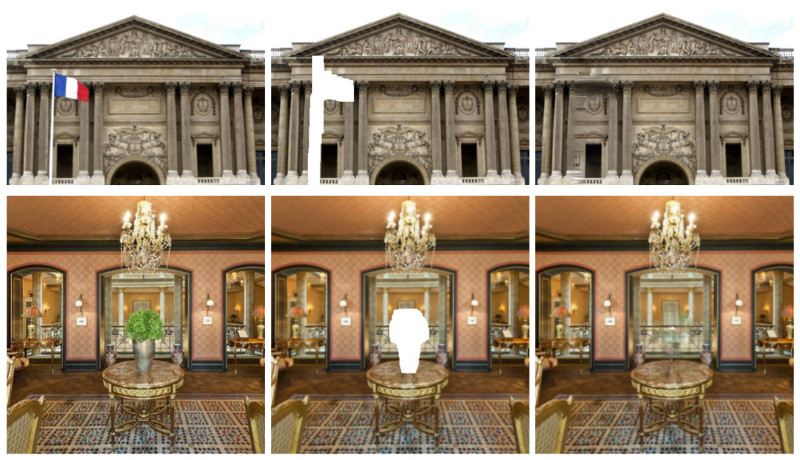
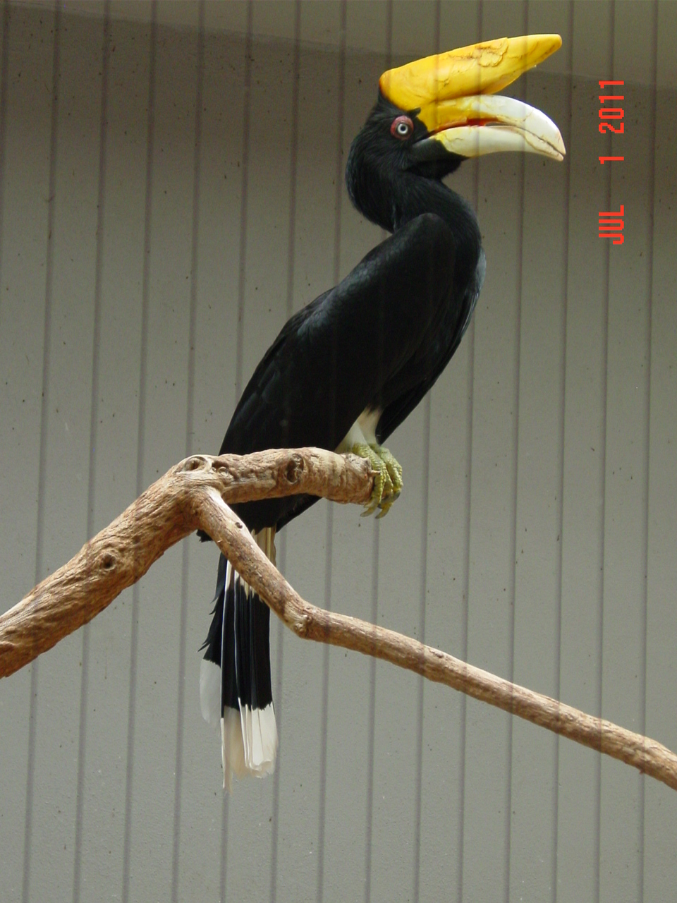

## Intro

Scott Mueller

###### smueller.tampa.ai@gmail.com

---
## Tampa.ai

Looking for Presenters

---
# Repairing Images without GAN
---
* Examples
* How does it work?
* Using a GAN
* Transfer Learning with a GAN
* Sophisticated Loss Function
* Example Project

---
## Repair Image

---
## Super Resolution

---
## Batch Transformation

Files on Disk
---
## Inline Transformation

Processed In-memory
---
## GANs

---
## Transfer Learning

Train Generator using MSE loss
---
## Train Critic/Discriminator

Rinse and Repeat
---
## What if Used Sophisticated Loss

---
## Fast.ai Lesson 7 Super-Res

[Lesson 7 Super Resolution](./nbs/lesson7-superres.pdf)

---
## Apply to New Problem

---
## Generate After Image

* Gatys Style Transfer on ~5,000 images

---
## Create Style

[Gatys Style Transfer - rentrant](./nbs/CreateStyles.pdf)

---
## Super Res Monet Sunset

[Super Resolution Pets Monet Sunset](./nbs/superres-pets-monet-sunset-style.pdf)

---
## Style Results

---
## What could you do with this technique?
---

---

---

---

---
[Bringing black and white photos to life using Colourise.sg — a deep learning colouriser trained with old Singaporean photos](https://blog.data.gov.sg/bringing-black-and-white-photos-to-life-using-colourise-sg-435ae5cc5036)

---
[Colorizing and Restoring Old Images with Deep Learning](https://blog.floydhub.com/colorizing-and-restoring-old-images-with-deep-learning/)

---
Questions?
---
## Study Group

https://ai-tampa-study-group.github.io/meetings/

---

[KnowFalls.com](https://www.KnowFalls.com/)

Looking for Founder Fastai ML Practitioners

Elixir, Functional Programming, Rails, Experience

Web presentation skills